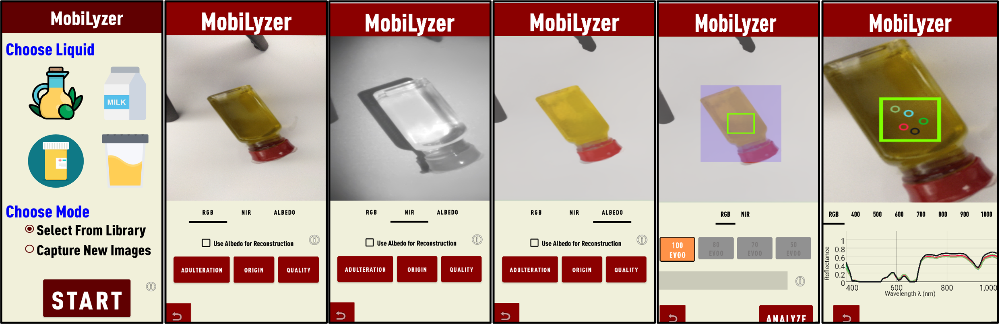
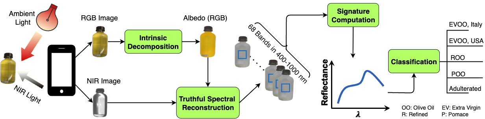

# MobiLyzer: Fine-grained Mobile Liquid Analyzer

This repository provides the official implementation of the  IMWUT/Ubicomp 2026 paper:  

**MobiLyzer: Fine-grained Mobile Liquid Analyzer**  
*[Shahrzad Mirzaei]()*<sup>1</sup>, *[Mariam Bebawy]()*<sup>1</sup>, *[Amr Mohamed Sharafeldin]()*<sup>1</sup>, and *[Mohamed Hefeeda]()*<sup>1,2</sup>  

<sup>1</sup> School of Computing Science, Simon Fraser University, BC, Canada

<sup>2</sup>  Qatar Computing Research Institute, Hamad Bin Khalifa University, Doha, Qatar

📄 [Paper – pending]() | 📑 [Supplementary – pending]() | 🎥 [Demo Video – pending]() | [Application – pending]()

  

---

## Overview and Components

 MobiLyzer supports tasks such as:  

- **Fraud detection** (e.g., adulterated olive oil)  
- **Quality assessment** (e.g., Extra virgin olive oil vs Refined olive oil)  
- **Origin labeling** (e.g., Italian olive oil vs American olive oil)
- **Composition labeling** (Fat, Protein, and sugar composition analysis)
- **Medical diagnostics** (e.g., urine analysis) 



The repository is organized into four main modules:

1. **Intrinsic Decomposition**  
   Separation of reflectance and illumination components to recover material properties.

2. **Hyperspectral Reconstruction**  
   Truthful reconstruction of spectral signatures from RGB smartphone images.  

3. **Liquid Analysis**  
    classification for fraud detection, composition analysis, and diagnosis.  

4. **Mobile Application**  
   A lightweight Android app for real-time liquid analysis on smartphones. [Link – pending]()

---

## Repository layout

```text
mobilyzer/
├─ reconstruction/                 # TSR training & evaluation
│  ├─ architecture/                # MST++ backbone and TSR heads
│  ├─ helper_matrices/             # S, B, PS, PB (for cmf & NIR centers)
│  ├─ train.py                     # Train TSR (truthful spectral recon)
│  ├─ test.py                      # Quantitative eval (SAM/SID/PSNR/ΔE/MAE)
│  ├─ utils.py, losses.py, utils_truthful.py  # TSR heads
│  └─ hsi_dataset_mobilyzer.py     # HSI dataset loader
├─ classification/                 # 1D-CNN classifiers on signatures
│  ├─ dataset.py                   # loads signature tensors & labels
│  ├─ train.py                     # k-fold training
│  └─ test.py                      # hold-out evaluation & reports
├─ datasets/
│  ├─ HSI/                         # Specim IQ VNIR (204 bands, and RGB+NIR)
│  └─ phone/                       # (RGB+NIR from smartphone camera)
├─ models/
│  ├─ HSI/                         # pre-trained models for reconstruction
│  └─ phone/                       # pre-trained models for classification
├─ figures/                        # paper figures & diagrams
├─ LICENSE
├─ environment.yml
└─ README.md
``` 
---

## Quickstart

### 1) Environment

- Python ≥ 3.9 (Conda recommended)  
- CUDA-enabled PyTorch (tested with 1.8.1 and 2.1+)  
- See `environment.yml` for pinned versions.  

```bash
conda env create -f environment.yml
conda activate mobilyzer
```
### 2) Install PyTorch

GPU:

```bash

python -m pip install --index-url https://download.pytorch.org/whl/cu121 torch==2.4.1 torchvision==0.19.1 triton==3.0.0

```

CPU:

```bash

python -m pip install --index-url https://download.pytorch.org/whl/cpu torch==2.4.1 torchvision==0.19.1 triton==3.0.0

```

## Dataset


```text
Download the data from this LINK XXX
```
```bash

dataset_open/
├─ data/
│  ├─ evoo/
│  ├─ milk/
│  ├─ honey/
│  ├─ medicine/
│  └─ urine/
│
│  Each liquid folder contains:
│  ├─ HSI/           # Hyperspectral data (spectra + aligned RGB/NIR)
│  └─ phone/         # Smartphone data organized by each case
│     ├─ fraud/
│     ├─ origin/
│     └─ quality/
│
└─ models/           # Trained weights / checkpoints


```

## Getting Started

### 1) Intrinsic Decomposition


### 2) Truthful Spectral Reconstruction(TSR)
Training TSR from Scratch
```bash
python3 reconstruction/train.py --data_root /path/to/dataset/liquid/HSI/ --liquid evoo --epochs 300 --batch_size 16 --lr 1e-4 --patch_size 64
```
Using Pre-trained TSR Models
```bash

python3 reconstruction/test.py --model_path models/HSI/TSR_evoo_best.pth --input_dir datasets/phone/evoo/origin/ --output_dir datasets/phone/evoo/origin/reconstructed/ --liquid evoo

```
```text
Available pre-trained models:

models/HSI/TSR_evoo_best.pth - Extra Virgin Olive Oil - Link
models/HSI/TSR_milk_best.pth - Milk samples - Link
models/HSI/TSR_honey_best.pth - Honey samples - Link
models/HSI/TSR_medicine_best.pth - Medicine samples - Link
models/HSI/TSR_urine_best.pth - Urine samples - Link

```
### 3) Liquid Analysis

```bash

python3 classification/train.py --data_root /path/to/dataset/liquid/phone/task/reconstructed/ --liquid evoo --n_splits 4 --max_epochs 100 --batch_size 256

```

### 4) Model Evaluation

```bash

python3 classification/test.py --models_dir models --liquid evoo --n_splits 4

```


### 5) Mobile Application

XXX Link

## Citation

If you use this code or dataset in your research, please cite:  

XXX Pending
```bibtex


@article{mobilyzer-imwut26,
  title={MobiLyzer: Fine-grained Mobile Liquid Analyzer},
  author={Mirzaei, Shahrzad and Bebawy, Mariam and Sharafeldin, Amr Mohamed and Hefeeda, Mohamed},
  journal={Proceedings of the ACM on Interactive, Mobile, Wearable and Ubiquitous Technologies},
  year={2026}
}

```

